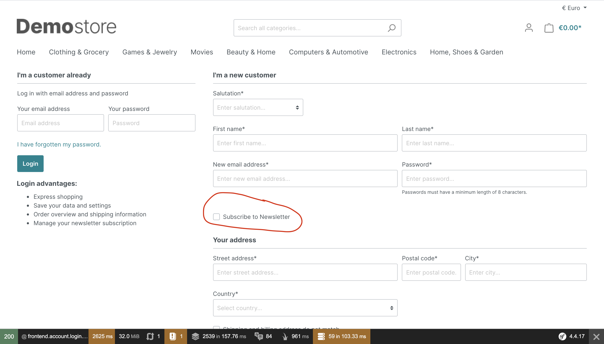

# Shopware Registration Newsletter Sign Up

> This shopware plugin allows to give the customer who registers the possibility to subscribe to the newsletter during registration.

## Table of Contents

- [Background](#background)
- [Install](#install)
- [Usage](#usage)
- [API](#api)
- [Maintainers](#maintainers)
- [Contribute](#contribute)
- [License](#license)

## Background
This plugin offers the possibility to configure a Shopware store so that the buyer can directly subscribe to the newsletter when he registers.

## Install
> TBD - publish to packagist.org

## Usage
Install the plugin like every other shopware plugin. Don't forget to activate it. Once installed you have to enable showing the checkbox to opt in for the newsletter on the registration page. To do that, go to the "Basic Configuration" and enable it.

## API
> TBD

## Maintainers
[@florianlenz](https://github.com/florianlenz)

## Contribute
> TBD

## License

MIT © 2020 Florian Lenz
